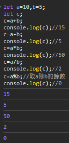
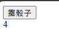

# `HTML` basic III
照慣例，我們很快就不是在講`HTML`了  
p.s. 最近社長超忙，下禮拜有比賽，這禮拜三又生病，這份講義生的很趕，品質嚴重不良，敬請見諒
# `HTML` `class`
`class`是一種`HTML`屬性，下面範例
```html
<div class="a"></div>
```
- `class`的值可以是任何字串
- 一個`HTML`標籤可以有多個`class`
- 一個`class`可以被多個`HTML`標籤使用
- 以空格分隔

`class`主要會和`CSS`樣式搭配使用，下面範例
```html
<style>
	.class名稱{
		/*樣式here*/
	}
	.success{
		color: green;
	}
	.warning{
		color: yellow;
	}
	.danger{
		color: red;
	}
	.dark{
		background-color: #000;
	}
</style>
<div class="success">成功辣</div>
<div class="warning">警告！</div>
<div class="danger">危險！危險！</div>
<div class="danger dark">危險！危險！</div>
```
  
[sample](./class)  
[source](https://github.com/pcic35-html/class3/blob/main/class/index.html)  
同樣都是`div`，但因為套用了不同的`class`，所以顯示的顏色不同  
如果一個`HTML`標籤有多個`class`，則會套用多個`class`的樣式  

# `HTML` `id`
`id`是一種`HTML`屬性，下面範例
```html
<div id="a"></div>
```
- `id`的值可以是任何字串
- 一個`HTML`標籤只能有一個`id`
- 一個`id`只能被一個`HTML`標籤使用

`id`主要會和`JavaScript`搭配使用，後面會講到，不要忘記

# `JS` basic
...  
阿所以`HTML` `CSS` `JS` 之間有甚麼差別  
- `HTML` 骨架，用於設定網頁基本架構
- `CSS` 樣式，讓網頁變得好看
- `JS` 動態，讓網頁可以互動

## `JS` How to start?
在`HTML`中，使用`<script></script>`標籤來寫`JS`  
```html
<html>
	<head></head>
	<body>
		<!--你的HTML 程式碼-->


		<script>
			/*你可以在這邊寫JS*/
			console.log("Hello World!");
		</script>
	</body>
</html>
```
## `JS` 基本語法、註解
```js
程式碼;
程式碼;
後面的分號很重要;
不要忘了加;
//使用兩個斜線，這行後面都會變成註解
//註解內的東西不會編譯
/* 這是區域註解 */在區域外的程式碼會被執行到;

		和HTML一樣;
				縮牌沒有硬性規定;
								但不要像這樣亂縮排;
																很醜;
```
## `Hello World!`
如題，我們又双叒叕要來寫`Hello World!`ㄌ  
在`JS`，使用`console.log(把要輸出的東西放進來);`可以輸出東西  
順帶一提，如果要輸出指定字串，要用`""`包起來，不然`JS`會把它視為變數
```html
<script>
console.log("Hello World!");
</script>
```
  
wait, nothing!?  
因為它會輸出到終端機裡面，按`F12`按鈕，右邊會多出一個開發者介面，切換到`主控台`(`console`)分頁  
p.s. 根據使用的瀏覽器，介面、名稱可能會不一樣，這裡以Microsoft Edge做示範  
  
可以從右邊的`log`看到，`Hello World!`成功輸出了  
[sample](./first_js/)
[source](https://github.com/pcic35-html/class3/blob/main/first_js/index.html)  

## `JS` `let` 變數
在`JS`，使用`let`來宣告變數  
```html
<script>
	let 變數名稱 = 值;
	let a=1,b=2,c=3;//也可以一次宣告多個變數，用逗點分隔
</script>
```
在主控台中，我們可以輸入變數名，並按下`Enter`，就可以看到變數的值  
p.s. 某些瀏覽器會阻擋複製貼上行為，請自行輸入`allow pasting`並按下`Enter`來解除限制  
  
當然的，我們可以用`console.log()`來輸出變數的值  
```js
let a=1,b=2,c=3;
console.log(a);
console.log(b);
console.log(c);
```
[sample](./js_let/)  
[source](https://github.com/pcic35-html/class3/blob/main/js_let/index.html)
### ***插播警告！如果有不明人士要求你在`主控台`(`console`)上貼上程式碼，你99%是被騙了，請立即停止操作***
某些有心人士會透過`JS`獲取你的帳號的憑證，藉此使用你的帳號做非法的事，請務必注意  
p.s. `JS`無法跨網域存取，我們也沒有在這個網頁上設計帳號系統，不用擔心  


## `JS` `+ - * / %` 運算子

```js
let a=10,b=5;
let c;
c=a+b;
console.log(c);//15
c=a-b;
console.log(c);//5
c=a*b;
console.log(c);//50
c=a/b;
console.log(c);//2
c=a%b;//取a除b的餘數
console.log(c);//0
```
  
no sample, no source, do it in console.  

## `JS` `== != > < >= <=` 比較運算子
要特別注意，判斷兩數值是否相等時，要用`==`，而不是`=`  
若要一次比較三個數字，請使用`&&`(and)  
錯誤示範：`a==b==c`  
正確示範：
```js
//若條件成立，會輸出true，否則輸出false
let a=10,b=5;
console.log(a==b);//如果a等於b
console.log(a!=b);//如果a不等於b
console.log(a>b);//如果a大於b
console.log(a<b);//如果a小於b
console.log(a>=b);//如果a大於等於b
console.log(a<=b);//如果a小於等於b
```
  
no sample, no source, do it in console.  

## `JS` `if` 判斷式
我們想要在某個條件成立下才做某些事  
例如說，a>b時，我們就輸出`a比b大`，相反的，a\<b時，我們就輸出`a比b小`  
```js
if(/*判斷式*/){
	/*成立時，需要執行的程式碼*/
}else if(/*判斷式*/){
	/*第一個判斷式不成立，且這個判斷式成立時，需要執行的程式碼*/
}else{
	/*上面所有判斷式都不成立時*/
}

let a=10,b=5;//你可以自訂這些變數，會有不一樣的結果
if(a>b){
	console.log("a比b大");
}else if(a==b){
	console.log("a等於b");
}else{
	console.log("a比b小");
}
```
no sample, no source, do it in console.  

## `JS` `random` 隨機數
我們想要讓網頁多一點驚喜，這個時候，可以使用看看`random`  
```js
let a=Math.random();//會產生0~1之間的隨機數
```
  
no sample, no source, do it in console.  
p.s. 每個人的輸出結果可能不一樣，因為他式random，都一樣的話就不randomㄌ  
p.s. 若想要生成新的亂數，請再打一次`a=Math.random();`  

## `JS` `function` 函式
透過函式，我們可以簡化我們的程式碼
```js
function 函式名稱(參數1,參數2,參數3...){
	/*函式內的程式碼*/
}
function hi(){
	console.log("尼好阿啊錒锕ㄚ");
	return 0;//執行完函式後，會回傳0
}
let a=hi();//呼叫函式
let b=hi();//回傳值會被存到變數中
```
  
no sample, no source, do it in console.  

只要我在程式碼輸入`hi();`，就會執行`hi()`函式內的程式碼  

<!--12/15 課程講到這-->

讓我們建立一個`randomint()`函式，可以產生一個區域內的隨機整數  
```js
function randomint(l,r){
	let loop=r-l+1;//計算範圍內有幾個數字
	let a=Math.random();//產生0~1之間的隨機數
	a*=loop;//乘上範圍內的數字個數 0 <= a < loop
	a+=l;//加上最小值 l <= a < l+loop
	//l <= a < r+1
	//Math.floor(a) 會回傳a的整數部分
	//例如說 Math.floor(1.5) 會回傳 1
	return Math.floor(a);//取整數
}

randomint(1,6);
```
  
no sample, no source, do it in console.  
我們就可以輕鬆產生1~6之間的亂數了  

# `HTML` `<button>` 按鈕
歡迎回來`HTML`  
`<button>`是一個`HTML`標籤，可以用來製作按鈕  
還可以設定按下去後要執行的`JS`程式碼  
```html
<button>按鈕內的文字</button>
<button onclick="你可以在這邊寫JS程式碼;">但通常只會放函式名稱</button>
```
  
[sample](./html_button/)  
[source](https://github.com/pcic35-html/class3/blob/main/html_button/index.html)  
現在點下去還沒有動作，因為我們還沒有寫`JS`程式碼  
結合我們的`randomint()`函式，我們可以做一個擲骰子的程式  
```html
<!DOCTYPE html>
<html>
	<head></head>
	<body>
		<button onclick="randomint(1,6)">擲骰子</button>

		<script>
			function randomint(l,r){
				let loop=r-l+1;
				let a=Math.random();
				a*=loop;
				a+=l;
				/*增加這一行*/a=Math.floor(a);//取整數
				/*增加這一行*/console.log(a);//輸出a
				return a;
			}
		</script>

	</body>
</html>
```
  
[sample](./js_fn/)  
[source](https://github.com/pcic35-html/class3/blob/main/js_fn/index.html)  
每按一次按鈕，就會產生一個1~6之間的亂數  
但這對使用者太不友善了，看個結果還要開主控台  

# `JS` `document.getElementById()` 控制`HTML`元素
我們可以透過`document.getElementById()`來控制`HTML`元素  
```html
<div id="hi">我愛小ㄌㄌ</div>
<script>
document.getElementById("id名稱");//這行指令可以控制id為hi的元素
document.getElementById("hi").innerHTML="你好";//使用.innerHTML可以操控元素內的文字
//這行指令會把id為hi的元素內的文字從"我愛小ㄌㄌ"改成"你好"
</script>
```
  
[sample](./js_docs/)  
[source](https://github.com/pcic35-html/class3/blob/main/js_docs/index.html)  
可以看到，原本應該顯示`我愛小ㄌㄌ`的地方，變成`你好`了  
同樣的概念，我們可以建立一個`<div>`，並設定一個`id`，然後透過`JS`來讓他顯示骰子骰出來的內容  
```html
<!DOCTYPE html>
<html>
	<head></head>
	<body>
		<button onclick="randomint(1,6)">擲骰子</button>
		<div id="result">這裡會顯示結果</div>
		<script>
			function randomint(l,r){
				let loop=r-l+1;
				let a=Math.random();
				a*=loop;
				a+=l;
				a=Math.floor(a);//取整數
				/*修改這一行*/document.getElementById("result").innerHTML=a;//輸出a
				return a;
			}
		</script>

	</body>
</html>
```
  
[sample](./js_dice/)  
[soruce](https://github.com/pcic35-html/class3/blob/main/js_dice/index.html)  
每按一次骰子，就會更新結果  

# 檔案結構
回過頭來看，所有東西都混在一個網頁裡面，重點不突出，也不好維護  
但如果把這個網頁砍掉重練，我想沒有人會接受  
那就在建立一個頁面  
1. 建立一個資料夾，名稱請打英文  
  
2. 點擊資料夾右邊的`...`>`new file`  
  
3. 檔名取為`index.html`  
4. 開啟該檔案

如果我們想要造訪這個網頁，請在網址最後面加上 `/資料夾名稱`  
例如 `https://kagariet01.github.io` `/dice`  
注意，若尾端已經有斜線，則不需要再加上`/`  
錯誤示範： `https://kagariet01.github.io/` `/dice`  

現在，我們有新的頁面可以用了，在這邊寫上擲骰子的程式碼  
這邊也把範例程式碼搬下來了，供大家~~參考~~***複製***  
```html
<!DOCTYPE html>
<html>
	<head></head>
	<body>
		<button onclick="randomint(1,6)">擲骰子</button>
		<div id="result">這裡會顯示結果</div>
		<script>
			function randomint(l,r){
				let loop=r-l+1;
				let a=Math.random();
				a*=loop;
				a+=l;
				a=Math.floor(a);//取整數
				/*修改這一行*/document.getElementById("result").innerHTML=a;//輸出a
				return a;
			}
		</script>

	</body>
</html>
```
(其實就只是把上面的東西複製下來而已)  
[sample](./js_dice/)  
[soruce](https://github.com/pcic35-html/class3/blob/main/js_dice/index.html)  

# 美化我們的網頁
如題，我們要美化我們的網頁  
這邊沒有一個標準答案  
你唯一要做的事情就是用盡你的所有能力，讓網頁變好看  
[推薦的素材庫](https://fonts.google.com/icons)  
## How do I do?
首先，我讓所有元素置中  
將`html` `body`的`width`和`height`都設為`100%`  
  
接者讓`body`內的元素使用`flex`置中  
  
參考`CSS`程式碼  
```css
.center{/*class裡有center的元素，內部的元素會左右、上下置中*/
	width: 100%;
	height: 100%;
	display:flex;
	flex-direction: column;
	justify-content: center;
	align-items: center;
}
```
再來，我在[google 的素材庫](https://fonts.google.com/icons?icon.query=Looks)裡面找到1~6的圖案  
  
所以我更改了骰子顯示方式，從原本的文字改成圖片  
  
相對的，`JS`程式碼也需要有相對應的修改  
```js
function randomint(l,r){
	let loop=r-l+1;
	let a=Math.random();
	a*=loop;
	a+=l;
	a=Math.floor(a);//取整數
	/*前面是傳統的亂數產生器*/
	/*根據不同的骰子結果，放上不同的圖片*/
	if(a==1){
		document.getElementById("dice").innerHTML=
			'';//可以將innerHTML設為HTML程式碼
		//這邊讓innerHTML設為，實際顯示時會顯示圖片
		//請注意，這邊JS的引號使用單引號，HTML的引號使用(也只能使用)雙引號，讓JS能夠正確解析
	}
	if(a==2){
		document.getElementById("dice").innerHTML=
			'';
	}
	if(a==3){
		document.getElementById("dice").innerHTML=
			'';
	}
	if(a==4){
		document.getElementById("dice").innerHTML=
			'';
	}
	if(a==5){
		document.getElementById("dice").innerHTML=
			'';
	}
	if(a==6){
		document.getElementById("dice").innerHTML=
			'';
	}
}
```
整個程式碼如下：  
[`index.html`](https://pcicclass--kagariet01.repl.co/dice/)
```html
<!DOCTYPE html>
<html style="width:100%;height:100%;" lang="zh-tw">
	<head>
		<meta charset="UTF-8">
		<title>擲骰子</title>
		<style>
			body{
				width: 100%;
				height: 100%;
				display:flex;
				flex-direction: column;
				justify-content: center;
				align-items: center;
			}
			.dice{
				width:min(90%,100px);
				height:min(90%,100px);
			}
			.dice_image{
				width:100%;
				height:100%;
			}
		</style>
	</head>
	<body>
		<div class="dice" id="dice">
			
		</div>
		<button onclick="randomint(1,6)">擲骰子</button>
		<script>
			function randomint(l,r){
				let loop=r-l+1;
				let a=Math.random();
				a*=loop;
				a+=l;
				a=Math.floor(a);//取整數
				if(a==1){
					document.getElementById("dice").innerHTML=
						'';
				}
				if(a==2){
					document.getElementById("dice").innerHTML=
						'';
				}
				if(a==3){
					document.getElementById("dice").innerHTML=
						'';
				}
				if(a==4){
					document.getElementById("dice").innerHTML=
						'';
				}
				if(a==5){
					document.getElementById("dice").innerHTML=
						'';
				}
				if(a==6){
					document.getElementById("dice").innerHTML=
						'';
				}
				///*修改這一行*/document.getElementById("result").innerHTML=a;//輸出a
				return a;
			}
		</script>
	</body>
</html>
```
（素材檔案，供大家下載）  
[`0.svg`](https://pcicclass--kagariet01.repl.co/dice/0.svg)  
[`1.svg`](https://pcicclass--kagariet01.repl.co/dice/1.svg)  
[`2.svg`](https://pcicclass--kagariet01.repl.co/dice/2.svg)  
[`3.svg`](https://pcicclass--kagariet01.repl.co/dice/3.svg)  
[`4.svg`](https://pcicclass--kagariet01.repl.co/dice/4.svg)  
[`5.svg`](https://pcicclass--kagariet01.repl.co/dice/5.svg)  
[`6.svg`](https://pcicclass--kagariet01.repl.co/dice/6.svg)  

[sample](./dice/)  
[source](https://github.com/pcic35-html/class3/blob/main/dice/index.html)  


恭喜你完成一個專案~~，楞著幹嘛，把結果丟到學習歷程阿，離資工系又近了一步~~  
# ET01說故事時間
我累了，放過我把  
`[小ㄌㄌ]` : 是中邪了嗎？是生病了嗎？  
`[ET01]` : 確實，我生病了  


 <p xmlns:cc="http://creativecommons.org/ns#" xmlns:dct="http://purl.org/dc/terms/"><a property="dct:title" rel="cc:attributionURL" href="https://pcic35-html.github.io/class3/">板中資訊社35th_HTML組_第三節設課_講義</a> by <a rel="cc:attributionURL dct:creator" property="cc:attributionName" href="https://kagariet01.github.io/about">KagariET01</a> is licensed under <a href="http://creativecommons.org/licenses/by-nc-sa/4.0/?ref=chooser-v1" target="_blank" rel="license noopener noreferrer" style="display:inline-block;">CC BY-NC-SA 4.0</a></p> 